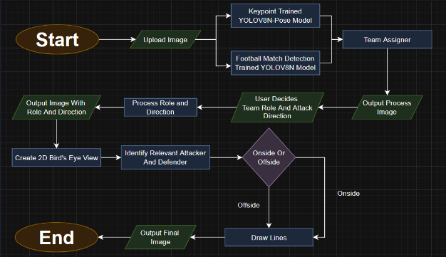
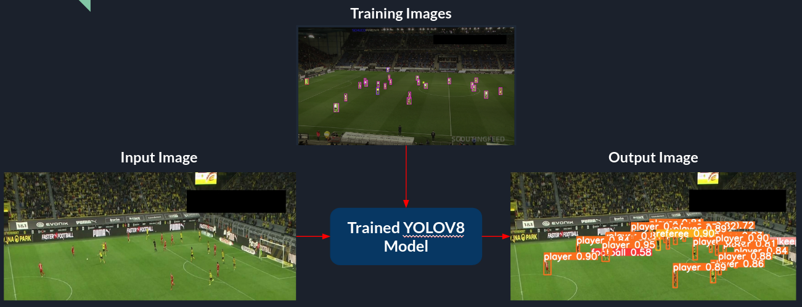
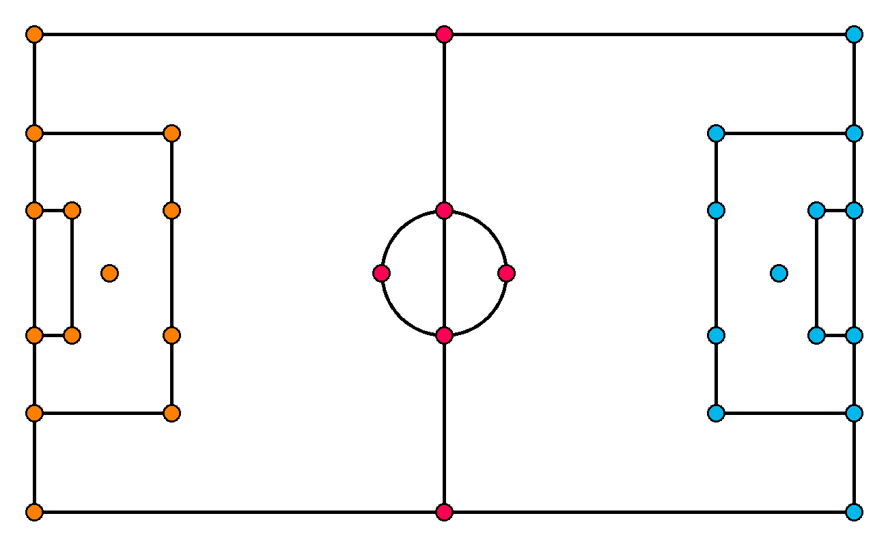
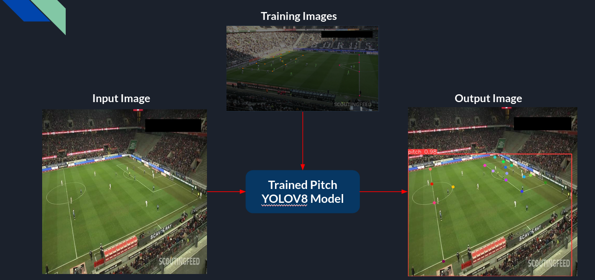
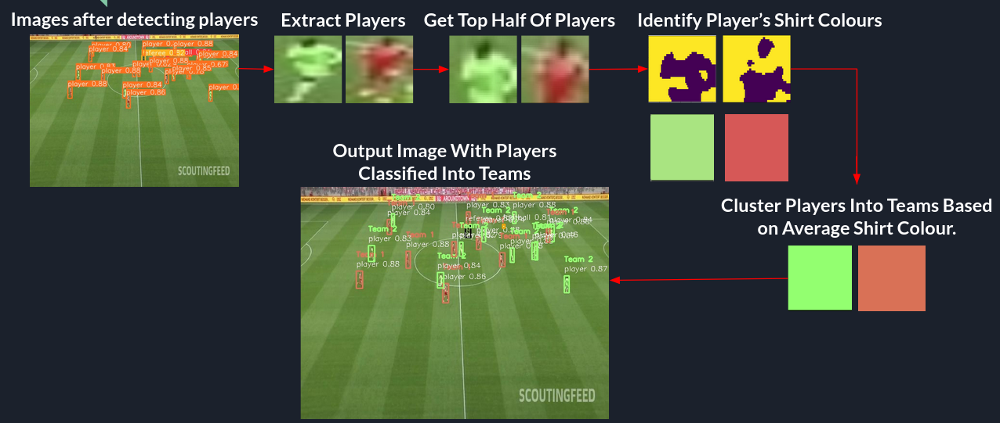
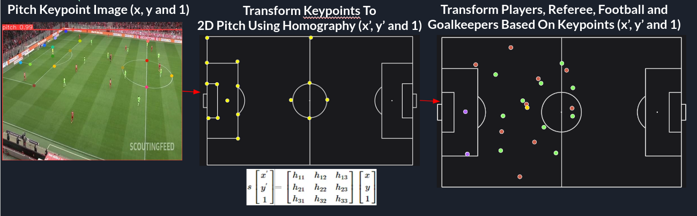
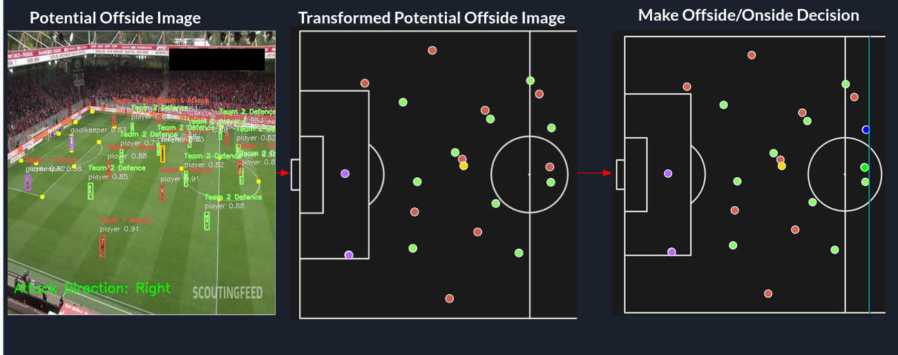

# Offside Detection System Using Computer Vision And Machine Learning

A Football Tkinter GUI, using YOLOV8 for object detection, K-means clustering for player team classification, and tomography for 2D pitch transformation.

## Table of Contents

- [Offside Detection System Using Computer Vision And Machine Learning](#offside-detection-system-using-computer-vision-and-machine-learning)
  - [Table of Contents](#table-of-contents)
  - [Brief Description \& Demo](#brief-description--demo)
  - [Installation \& Usage](#installation--usage)
  - [Key Features](#key-features)
  - [System Architecture](#system-architecture)
  - [System Breakdown](#system-breakdown)
    - [1. Object Detection (YOLO)](#1-object-detection-yolo)
    - [Description:](#description)
    - [How It Works:](#how-it-works)
    - [Process:](#process)
    - [Image Example:](#image-example)
  - [2. Keypoint Detection](#2-keypoint-detection)
    - [Description:](#description-1)
    - [How It Works:](#how-it-works-1)
    - [Process:](#process-1)
    - [Image Example:](#image-example-1)
  - [3. Team Classification (K-Means Clustering)](#3-team-classification-k-means-clustering)
    - [Description:](#description-2)
    - [How It Works:](#how-it-works-2)
    - [Process:](#process-2)
    - [Image Example:](#image-example-2)
  - [4. 2D Pitch Transformation (Homography)](#4-2d-pitch-transformation-homography)
    - [Description:](#description-3)
    - [How It Works:](#how-it-works-3)
    - [Process:](#process-3)
    - [Image Example:](#image-example-3)
  - [5. Offside/Onside Detection Algorithm](#5-offsideonside-detection-algorithm)
    - [Description:](#description-4)
    - [How It Works:](#how-it-works-4)
    - [Process:](#process-4)
  - [6. Visualisation](#6-visualisation)
    - [Description:](#description-5)
    - [How It Works:](#how-it-works-5)
    - [Process:](#process-5)
    - [Image Example:](#image-example-4)
  - [Benefits](#benefits)
    - [Detection \& Accuracy](#detection--accuracy)
    - [Prototype Performance](#prototype-performance)
  - [Limitations](#limitations)
  - [Future Work](#future-work)
  - [References](#references)

## Brief Description & Demo

This project aims to automate offside detection in football using deep learning and image processing techniques. It identifies players, the ball, the referee, and the goalkeeper from individual match screenshots, before classifying them into teams using K-means clustering based on shirt colours. It analyses their positions on a transformed 2D pitch to detect and visualise potential offside, as demonstrated below.


## Installation & Usage

Clone Repo

```bash
git clone https://github.com/yourusername/offside-detection.git
```

Move into Offside-Detection-System Folder

```bash
cd Offside-Detection-System
```

Install the Relevant Libraries

```bash
pip install -r requirements.txt
```

Run Program

```bash
python main.py
```

## Key Features

- GUI built with Tkinter for easy interaction
- Upload Chosen Images
- YOLOv8-based object detection players, ball, referee, goalkeeper and keypoints
- K-Means clustering for team classification
- 2D pitch transformation using homography, with MplSoccer Library for Pitch Creation
- Automated offside line visualisation and decision

## System Architecture

Below is the architecture diagram representing the system's process, which will be explained in detail in subsequent sections, but a simple overview is upload image -> YOLOV8 detection model -> K-means clustering Team Assigner -> Assign Team Roles & Attack Direction -> Create 2D Bird's Eye View using Homography -> Make Onside/Offside Decision based on relevant players.



## System Breakdown

This section provides an in-depth explanation of the core components and algorithms used in the Offside Detection System.

---

### 1. Object Detection (YOLO)

### Description:

Object detection identifies various objects on the football pitch such as players, the ball, referees, and goalkeepers using the **YOLOV8 (You Only Look Once)** algorithm.

### How It Works:

- The model is trained on a custom dataset with 372 labelled images of football matches, containing classes such as players, ball, referee, and goalkeeper available [here](https://universe.roboflow.com/workspace1-8owu3/football-players-detection-3zvbc-bf79d/dataset/1).

### Process:

- **Input**: 1280px \* 1280px Images.
- **Output**: Bounding boxes around detected objects (players, ball, etc.).

### Image Example:



---

## 2. Keypoint Detection

### Description:

Keypoint detection uses YOLOV8 to detect 32 identified keypoints from 317 image subset of the object detection datasets available [here](https://universe.roboflow.com/workspace1-8owu3/football-field-detection-f07vi-iqfrt/dataset/1).

Shown in the image below from [here](https://blog.roboflow.com/camera-calibration-sports-computer-vision/)


### How It Works:

- Using a **pose estimation model**, we identify keypoints on the pitch if they have a confidence of >= 0.5.
- These keypoints are then used to accurately map the position of the player on the 2D pitch.

### Process:

- **Input**: Input Image.
- **Output**: Keypoint coordinates (e.g., (x, y) positions for each keypoint).

### Image Example:



---

## 3. Team Classification (K-Means Clustering)

### Description:

This algorithm uses **K-Means clustering** to classify players into two teams based on their detected kits.

### How It Works:

- The system first detects the colour of kits worn by players.
- Using the **K-Means** algorithm, players are clustered into two groups: one representing the attacking team and the other representing the defending team as chosen by the user.

### Process:

- **Input**: Cropped player images classified into using K-means clustering and taking the average colours of the two groups.
- **Output**: Teams classified into groups team 1 and team 2, before the user decides, which team is attacking and defending.

### Image Example:

## 
---

## 4. 2D Pitch Transformation (Homography)

### Description:

The **2D pitch transformation** is performed using **homography** to create a bird’s-eye view of the football pitch. This helps normalise the field, making it easier to calculate offside positions.

### How It Works:

- After identifying the relevant keypoints it normalises them to the 2D pitch coordinate system by calculating a homography matrix, which consists of affine transformations, such as rotations, shears, stretches and scaling.
- It then normalises the other player, referee, football and goalkeeper coordinates before performing a perspective transformation using the previously calculated homography matrix
- Before plotting them on the 2D bird's eye view of the pitch

### Process:

- **Input**: Identified keypoints, corresponding pitch keypoints, object keypionts, alongside a calculated homography matrix.
- **Output**: Transformed 2D bird’s-eye view of the pitch .

### Image Example:



---

## 5. Offside/Onside Detection Algorithm

### Description:

This is the core algorithm that determines whether a player is offside or onside. It uses the 2D transformed pitch and player positions to make the decision.

### How It Works:

- After identifying the relevant attackers and defenders, it then calculates the centre
- A player is considered **offside** if they are closer to the goal line than the second-to-last defender at the time the ball is played.

### Process:

- **Input**: Transformed 2D pitch, player positions.
- **Output**: Offside or Onside decision based on player coordinates.

---

## 6. Visualisation

### Description:

The results of the offside detection algorithm are visualized by overlaying lines on the 2D pitch, indicating the offside line, the positions of players, and whether they are offside or onside.

### How It Works:

- The system uses **MplSoccer** to draw:
  - Offside line
  - Player positions
  - Ball location
  - Team classifications

### Process:

- **Input**: 2D transformed pitch, player positions, offside decision.
- **Output**: Image with overlaid offside lines, players, referees, goalkeepers and football.

### Image Example:



## Benefits

### Detection & Accuracy

- **Players**: 97.73% accuracy
- **Referees**: 90.19% accuracy
- **Goalkeepers**: 82.05% accuracy
- **Team Classification**: 82% accuracy
- **Keypoint Detection**: 99% precision, 100% recall within the dataset

### Prototype Performance

- **Fast Processing**: ~24.7s per result (faster than traditional VAR systems)
- **Accurate 2D Pitch Mapping**: Reliable when keypoints are well spaced
- **Offside Classification**: Effective in clear, structured scenarios

---

## Limitations

- Football Detection Accuracy ~49%, needs improvement.
- Doesn’t generalise keypoints well to new images or perform accurately when they are close together.
- Struggles with team classification on similar kits and under poor lighting conditions.
- 2D Transformation: Less accurate when keypoints are close together.
- Cannot manually select players if misclassified for offside/onside detection.
- Offside lines are not drawn on the original match image.

---

## Future Work

- **Upgrade to YOLOv12**
- Improve goalkeeper/referee distinction (targeted data)
- Separate model for football detection
- Enhance team classification with shadow/glare correction
- Improve offside logic and precision
- Generalisation & UX enhancements
- Add user-controlled selection for attackers/defenders
- Collect broader datasets (new match angles)
- Use YOLOv12-seg segmentation to detect offside-relevant body parts
- Redesign the GUI for clarity and ease of use

## References

Durgapal, A. and Rowlinson, A. (2021a). Pitch Basics — Mplsoccer 1.4.0 Documentation. [online] Readthedocs.io. Available at: https://mplsoccer.readthedocs.io/en/latest/gallery/pitch_setup/plot_pitches.html#sphx-glr-gallery-pitch-setup-plot-pitches-py [Accessed 21 Feb. 2025].

Durgapal, A. and Rowlinson, A. (2021b). Scatter — Mplsoccer 1.4.0 Documentation. [online] Readthedocs.io. Available at: https://mplsoccer.readthedocs.io/en/latest/gallery/pitch_plots/plot_scatter.html [Accessed 21 Feb. 2025].

Gallagher, J. (2023). How to Draw a Bounding Box Prediction Label with Python. [online] Roboflow Blog. Available at: https://blog.roboflow.com/how-to-draw-a-bounding-box-label-python/ [Accessed 11 Dec. 2024].

OpenCV (2024). OpenCV: Drawing Functions in OpenCV. [online] Opencv.org. Available at: https://docs.opencv.org/3.4/dc/da5/tutorial_py_drawing_functions.html [Accessed 11 Dec. 2024].

Skalski, P. (2024). Camera Calibration in Sports with Keypoints. [online] Roboflow Blog. Available at: https://blog.roboflow.com/camera-calibration-sports-computer-vision/ [Accessed 21 Jan. 2025].

Tarek, A. (2024). Football_Analysis Team Analysis Code. [online] GitHub. Available at: https://github.com/abdullahtarek/football_analysis/blob/main/team_assigner/team_assigner.py [Accessed 11 Dec. 2024].

Ultralytics (2024c). Predict - YOLOv8 Docs. [online] Ultralytics. Available at: https://docs.ultralytics.com/modes/predict/ [Accessed 1 Jan. 2025].

Yadav, V. (2020). Homography: the Main Idea behind Many CV Applications. [online] Vaibhav Yadav’s Blog. Available at: https://vaibhavyadav.github.io/2020/12/14/Image-Stitching.html [Accessed 21 Jan. 2025].
